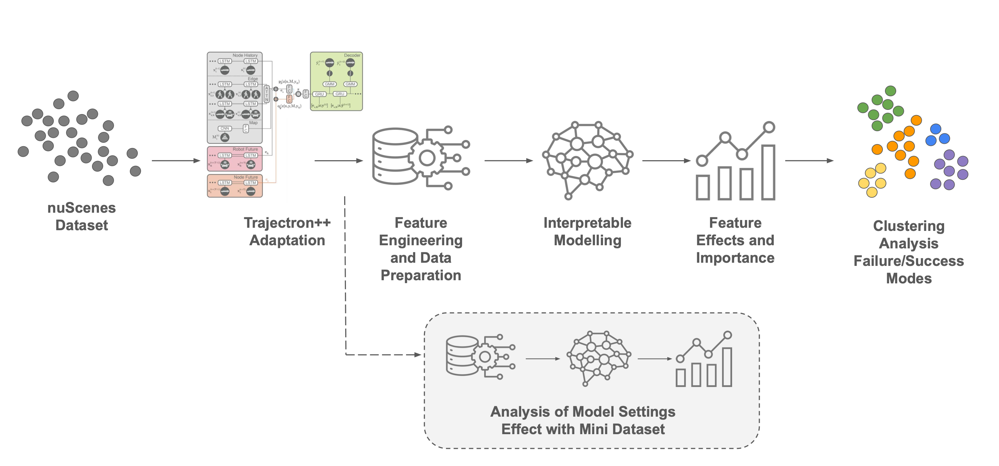

# Interpreting Trajectron++ Prediction Errors on nuScenes

This repository contains the code and evidence used to analyse why Trajectron++
predicts some pedestrian trajectories more accurately than others. The pipeline
recovers per-trajectory prediction errors, joins them with interpretable motion,
scene, and social features, and analyses those errors with GAM and XGBoost
meta-models.



## Research questions

1. Which trajectory and scene characteristics are associated with prediction
   performance?
2. Which interpretable success and failure modes explain performance?
3. How do observation history, prediction horizon, and attention radius affect
   performance within the tested ranges?

The project evaluates an existing trajectory-prediction model; it does not
propose a new prediction architecture. GAM and XGBoost are explanatory
meta-models of Trajectron++ error, not trajectory predictors.

## Repository map

| Path | Purpose |
|---|---|
| `train_unified.py` | Trajectron++ training and evaluation entry point. |
| `run_sweep.py` | Sequential settings-sweep runner and joined-run combiner. |
| `scripts/run_prediction_result_set.py` | Curates the named full-trainval and settings-sweep result sets. |
| `scripts/run_seeded_experiments.py` | Shared training, joining, seed aggregation, and manifest logic used by the curated runner. |
| `scripts/verify_report_tables.py` | Recomputes and checks report Tables 2, 13, and 14 from committed artifacts. |
| `scripts/validate_pipeline_paths.py` | Capped integration validation before expensive runs. |
| `src/trajectron/` | Adapted Trajectron++ model, evaluation, and utilities. |
| `src/data_preparation/` | Per-trajectory/scene metrics, joining, and explicit run combination. |
| `src/data_modelling/` | Preparation, GAM/XGBoost, inference, feature-effect, and mode-analysis workflows. |
| `config/` | Model, runtime, analysis, sweep, and split-index configuration. |
| `results/trajectory_prediction/trajectory_metrics_joined/` | Committed per-trajectory inputs for the submitted analyses. |
| `results/interpretable_model/` | Prepared data and exported model/effect/mode evidence. |
| `Report/` | Report source, cited figures, bibliography, and compiled PDF. |
| `Presentation/` | Presentation source, slide inputs, figures, and compiled PDF. |
| `unified-av-data-loader/` | Vendored `trajdata` dependency used by the training and join pipelines. |

## Environment and external data

The verified local environment is the conda environment `adaptive-py310`.
Commands should run from the repository root with:

```bash
export PYTHONPATH=src:unified-av-data-loader/src
export WANDB_MODE=disabled
export MPLBACKEND=Agg
```

The raw nuScenes release, trajdata cache, and full training checkpoints are not
committed. Download nuScenes under its licence and provide machine-local paths
through command-line overrides:

```bash
conda run -n adaptive-py310 python -m torch.distributed.run \
  --nproc_per_node=1 train_unified.py \
  --conf config/nuScenes_full_trainval.json \
  --trajdata_cache_dir /path/to/trajdata_cache \
  --data_loc_dict '{"nusc_trainval":"/path/to/v1.0-trainval_raw"}'
```

The prediction-challenge split indexes required by the data-loading code are
committed under `config/experimental_setup/nuScenes/`. Shared configuration
files contain the experiment settings; override their machine-specific data
paths locally and do not commit those local changes.

## Submitted result sets

The report and presentation use two single-seed result sets:

| Result set | Protocol | Committed joined input |
|---|---|---|
| Full trainval | 12 epochs, seed 123, fixed model settings | `results/trajectory_prediction/trajectory_metrics_joined/full_trainval_12ep_1seed/eval_epoch_12.csv` |
| Settings sweep | 30 epochs, seed 123, 64 settings | `results/trajectory_prediction/trajectory_metrics_joined/sweep_large_30ep_1seed/eval_epoch_30_combined.csv` |

The 64-setting grid is defined in `config/sweep_config_large.yaml`:

- history: 1, 2, 3, or 4 seconds;
- prediction horizon: 2, 3, 4, or 6 seconds;
- attention-radius scale: 0.25, 0.5, 1, or 2.

The realised `attention_radius_m`, rather than the internal scale multiplier,
is used in downstream interpretation.

## Regenerating the submitted evidence

### 1. Recreate per-trajectory prediction results

This stage performs the expensive Trajectron++ runs and requires the external
nuScenes data and cache. After configuring local data paths, the curated
entrypoints are:

```bash
conda run -n adaptive-py310 python scripts/run_prediction_result_set.py \
  --experiment full_trainval_1seed --phase all

conda run -n adaptive-py310 python scripts/run_prediction_result_set.py \
  --experiment sweep_large_1seed --phase all
```

Use `--phase train --dry_run` first to inspect every planned command without
starting training. The large-sweep dry run must report 64 combinations.

### 2. Recreate the interpretable analyses

The committed joined CSVs allow this stage to be rerun without retraining
Trajectron++. For the full-trainval analysis, execute the preparation, GAM,
XGBoost, inference, feature-effect, and selected mode-inspection workflows in
this order:

1. `src/data_modelling/interpretable_model_data_preparation.ipynb`
2. `src/data_modelling/gam.ipynb`
3. `src/data_modelling/xgboost.ipynb`
4. `src/data_modelling/model_inference_analysis.ipynb` for each model
5. `src/data_modelling/feature_effect_performance_regimes.ipynb` for each model
6. `src/data_modelling/feature_effect_pr_cluster_inspection.ipynb`

Step 6 reads the cluster exports committed under
`results/interpretable_model/feature_effect_performance_regimes/`, so it runs
against the submitted regimes without repeating the step-5 clustering sweep.

The preparation notebook distinguishes two run names, and reproducing the
submitted evidence requires setting both:

- `RAW_RUN_NAME` selects the joined-metrics export to read;
- `EXPORTED_RUN_NAME` names the prepared-data output that every downstream
  notebook then reads through `RUN_NAME`.

For the full-trainval analysis use `RAW_RUN_NAME="full_trainval_12ep_1seed"`,
`EXPORTED_RUN_NAME="full_trainval_12ep_1seed_MI_correct"` and
`EVAL_CSV_NAME="eval_epoch_12.csv"`; exclude model-setting columns as
predictors. The submitted evidence also includes the VIF-only comparison,
exported as `full_trainval_12ep_1seed_vif_only_no_collision`.

For the settings sweep use `RAW_RUN_NAME="sweep_large_30ep_1seed"`,
`EXPORTED_RUN_NAME="sweep_large_30ep_1seed_MI_corrected"` and
`EVAL_CSV_NAME="eval_epoch_30_combined.csv"`; include model-setting columns as
predictors and stop after model inference.

The workflow wrapper exposes the same contract, with `--run-name` selecting the
input and `--exported-run-name` the output namespace. Omitting
`--exported-run-name` makes the output namespace follow `--run-name`, which
writes beside the submitted evidence rather than into it:

```bash
conda run -n adaptive-py310 python \
  src/data_modelling/run_interpretable_notebook_workflow.py \
  --run-name sweep_large_30ep_1seed \
  --exported-run-name sweep_large_30ep_1seed_MI_corrected \
  --eval-csv-name eval_epoch_30_combined.csv \
  --include-model-settings-as-features \
  --models gam xgboost
```

### 3. Evidence provenance

| Finding | Primary evidence |
|---|---|
| RQ1: feature associations | Full-trainval joined CSV; `prepared_data/full_trainval_12ep_1seed_MI_correct/`; GAM and XGBoost exports with the same run name. |
| RQ2: success/failure modes | Full-trainval MI+VIF and VIF-only feature-effect/mode exports under `results/interpretable_model/feature_effect_performance_regimes/`. |
| RQ3: settings effects | Large-sweep joined CSV; `prepared_data/sweep_large_30ep_1seed_MI_corrected/`; corresponding GAM and XGBoost exports. |
| Report model and mode tables | The OOF prediction and nested-CV tables consumed by `scripts/verify_report_tables.py`. |
| Final figures | Exact copies under `Report/figures/` and `Presentation/figures/`. |

## Fast verification without retraining

Run the following from a clean checkout:

```bash
conda run -n adaptive-py310 python -m compileall -q \
  src scripts train_unified.py run_sweep.py

conda run -n adaptive-py310 python scripts/verify_report_tables.py --show

conda run -n adaptive-py310 python scripts/run_prediction_result_set.py \
  --experiment sweep_large_1seed --phase train --dry_run

conda run -n adaptive-py310 python -m pytest -q
```

All four commands should complete without error and the test suite should pass
in full. The report-table check recomputes 110 displayed values from committed
OOF and nested-CV artifacts. The dry run validates the exact 64-setting
experiment contract without training.

## Building the deliverables

```bash
cd Report
latexmk -pdf -interaction=nonstopmode -halt-on-error -recorder main.tex

cd ../Presentation
latexmk -gg -pdf -interaction=nonstopmode -halt-on-error -recorder main.tex
```

The verified builds produce `Report/main.pdf` and `Presentation/main.pdf`.

## Limitations

- The submitted Trajectron++ results use one training seed.
- Findings are specific to Trajectron++, pedestrian targets, nuScenes, and the
  tested setting ranges.
- Feature effects are observational associations with model error, not causal
  effects.
- Raw data and model checkpoints must be regenerated or supplied externally.
- Current features do not fully explain the highest-error tail.

## Acknowledgements

This project adapts Trajectron++ and uses the vendored `trajdata` loader. See
the report bibliography and package metadata for source attribution.
